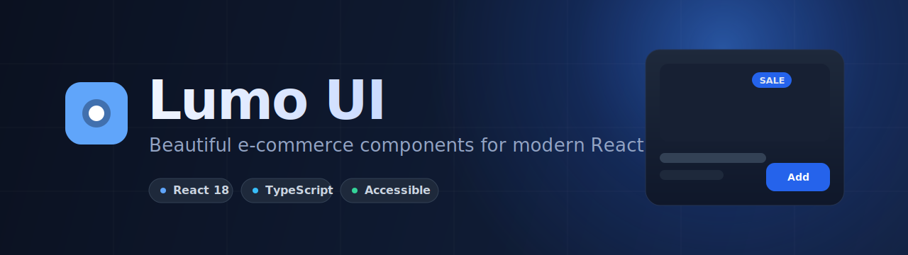

<div align="center">
  

  <h3>Beautiful e-commerce components for modern React apps</h3>
  <p>A TypeScript-first component library and toolkit built on shadcn/ui foundations, with accessibility first.</p>

  <p>
    <a href="https://www.npmjs.com/package/@lumo-ui/core"></a>
    <a href="https://opensource.org/licenses/MIT"></a>
    <a href="https://www.typescriptlang.org/"></a>
    <a href="https://react.dev/"></a>
    <a href="https://tailwindcss.com/"></a>
    
  </p>
</div>

## Overview

Lumo UI is a monorepo of building blocks for online stores. It ships accessible React components, e-commerce focused hooks, and pure utility functions for pricing, validation, and cart math. Components extend the shadcn/ui and Radix primitives you already know, so they drop into existing Tailwind projects without a new design system to learn.

## Features

- **Accessible by default.** Components target WCAG 2.1 AA with proper ARIA roles, keyboard navigation, and focus management.
- **TypeScript native.** Strict types throughout, no implicit `any`, full prop interfaces exported.
- **Built on shadcn/ui.** Uses Radix primitives and CSS variable theming for drop-in compatibility.
- **E-commerce focused.** Product cards, cart and wishlist hooks, checkout flow, and pricing utilities.
- **Tree-shakeable.** Each package builds dual ESM and CJS output via tsup with separate entry points.
- **Dark mode ready.** Theming driven by HSL CSS variables.
- **Tested.** Vitest and Testing Library coverage for components.

## Packages

| Package | Description |
| --- | --- |
| `@lumo-ui/core` | React components: `ProductCard`, `Card`, and shared class utilities. |
| `@lumo-ui/hooks` | E-commerce hooks: `useCart`, `useWishlist`, `useProductFilters`, `useProductSort`, `useCheckout`. |
| `@lumo-ui/utils` | Framework-agnostic helpers for currency, discounts, cart totals, tax, slugs, and validation. |

## Installation

```bash
# Core components
pnpm add @lumo-ui/core

# Optional companion packages
pnpm add @lumo-ui/hooks @lumo-ui/utils

# Peer dependencies
pnpm add react react-dom tailwindcss
```

> Requires React 18 and Tailwind CSS.

## Setup

1. Configure Tailwind to scan the package source:

```js
// tailwind.config.js
module.exports = {
  content: [
    './src/**/*.{js,ts,jsx,tsx}',
    './node_modules/@lumo-ui/core/**/*.{js,ts,jsx,tsx}',
  ],
}
```

2. Import the base layers and optional Lumo styles in your global stylesheet:

```css
/* globals.css */
@tailwind base;
@tailwind components;
@tailwind utilities;

@import '@lumo-ui/core/styles';
```

## Usage

```tsx
import { ProductCard } from '@lumo-ui/core'

function App() {
  const product = {
    id: '1',
    name: 'Premium Wireless Headphones',
    price: 199.99,
    originalPrice: 299.99,
    image: '/headphones.jpg',
    badge: 'sale',
    rating: 4.5,
    reviewCount: 128,
  }

  return (
    <ProductCard
      product={product}
      onAddToCart={(p) => console.log('Added to cart:', p)}
      onToggleWishlist={(p) => console.log('Wishlist toggle:', p)}
      onQuickView={(p) => console.log('Quick view:', p)}
    />
  )
}
```

### Hooks

```tsx
import { useCart, useWishlist } from '@lumo-ui/hooks'

function Storefront() {
  const { items, addItem, removeItem, total } = useCart()
  const { isInWishlist, toggle } = useWishlist()
  // ...
}
```

### Utilities

```ts
import { formatCurrency, calculateDiscount, validateEmail } from '@lumo-ui/utils'

formatCurrency(199.99)            // "$199.99"
calculateDiscount(299.99, 199.99) // percentage saved
validateEmail('hi@lumo-ui.com')   // true
```

## Components

### ProductCard

A responsive product card with variants, badges, ratings, and quick actions.

```tsx
<ProductCard
  product={{
    id: '1',
    name: 'Product Name',
    price: 99.99,
    image: '/product.jpg',
    badge: 'sale',          // 'sale' | 'new' | 'limited'
    originalPrice: 149.99,
    rating: 4.5,
    reviewCount: 25,
  }}
  variant="default"         // 'default' | 'compact' | 'featured'
  onAddToCart={handleAddToCart}
  onToggleWishlist={handleWishlist}
  onQuickView={handleQuickView}
  isInWishlist={false}
  showQuickActions={true}
  currency="$"
/>
```

#### Types

```ts
interface Product {
  id: string
  name: string
  price: number
  image: string
  badge?: 'sale' | 'new' | 'limited'
  originalPrice?: number
  rating?: number
  reviewCount?: number
  description?: string
}

interface ProductCardProps {
  product: Product
  variant?: 'default' | 'compact' | 'featured'
  onAddToCart?: (product: Product) => void
  onQuickView?: (product: Product) => void
  onToggleWishlist?: (product: Product) => void
  isInWishlist?: boolean
  showQuickActions?: boolean
  currency?: string
  className?: string
}
```

## Theming

Lumo UI reads HSL CSS variables, compatible with shadcn/ui tokens:

```css
:root {
  --background: 0 0% 100%;
  --foreground: 222.2 84% 4.9%;
  --primary: 221.2 83.2% 53.3%;
  --primary-foreground: 210 40% 98%;
  --secondary: 210 40% 96%;
  --secondary-foreground: 222.2 84% 4.9%;
  --muted: 210 40% 96%;
  --muted-foreground: 215.4 16.3% 46.9%;
  --accent: 210 40% 96%;
  --accent-foreground: 222.2 84% 4.9%;
  --destructive: 0 84.2% 60.2%;
  --destructive-foreground: 210 40% 98%;
  --border: 214.3 31.8% 91.4%;
  --input: 214.3 31.8% 91.4%;
  --ring: 221.2 83.2% 53.3%;
  --radius: 0.5rem;
}
```

## Accessibility

- WCAG 2.1 AA as the baseline
- ARIA labels and roles on interactive elements
- Full keyboard navigation
- Screen reader friendly markup
- Managed focus states
- Semantic HTML structure

## Project structure

```
lumo/
├── packages/
│   ├── core/      # React components
│   ├── hooks/     # E-commerce React hooks
│   └── utils/     # Framework-agnostic utilities
├── apps/
│   ├── www/       # Marketing and docs site (Next.js)
│   └── storybook/ # Component playground
└── README.md
```

## Development

This is a pnpm and Turborepo monorepo. Node 20 or newer and pnpm 9 or newer are required.

```bash
# Clone
git clone https://github.com/Nathandona/lumo.git
cd lumo

# Install
pnpm install

# Run all dev servers
pnpm dev

# Build every package
pnpm build

# Test, lint, type-check
pnpm test
pnpm lint
pnpm type-check

# Storybook
pnpm storybook
```

### Available scripts

| Script | Action |
| --- | --- |
| `pnpm dev` | Run all package and app dev servers via Turbo. |
| `pnpm build` | Build all packages and apps. |
| `pnpm test` | Run the Vitest suites. |
| `pnpm lint` | Lint with ESLint. |
| `pnpm type-check` | Type-check with the TypeScript compiler. |
| `pnpm storybook` | Launch the Storybook playground. |
| `pnpm changeset` | Create a changeset for versioning. |
| `pnpm release` | Build packages and publish via Changesets. |

### Adding a component

1. Create the component in `packages/core/src/components/`.
2. Export it from `packages/core/src/index.ts`.
3. Add full TypeScript types.
4. Include accessibility features.
5. Add a Storybook story.
6. Write tests.
7. Update the documentation.

## Contributing

Contributions are welcome. Please follow the existing code style and the guidelines below.

- Strict TypeScript, no `any`
- WCAG 2.1 AA compliance
- Tests for new behavior
- Semantic HTML
- Documentation for public APIs

## License

MIT. See [LICENSE](LICENSE).

## Acknowledgments

- [shadcn/ui](https://ui.shadcn.com/) for the component foundations
- [Radix UI](https://www.radix-ui.com/) for accessible primitives
- [Tailwind CSS](https://tailwindcss.com/) for styling
- [Lucide](https://lucide.dev/) for icons
